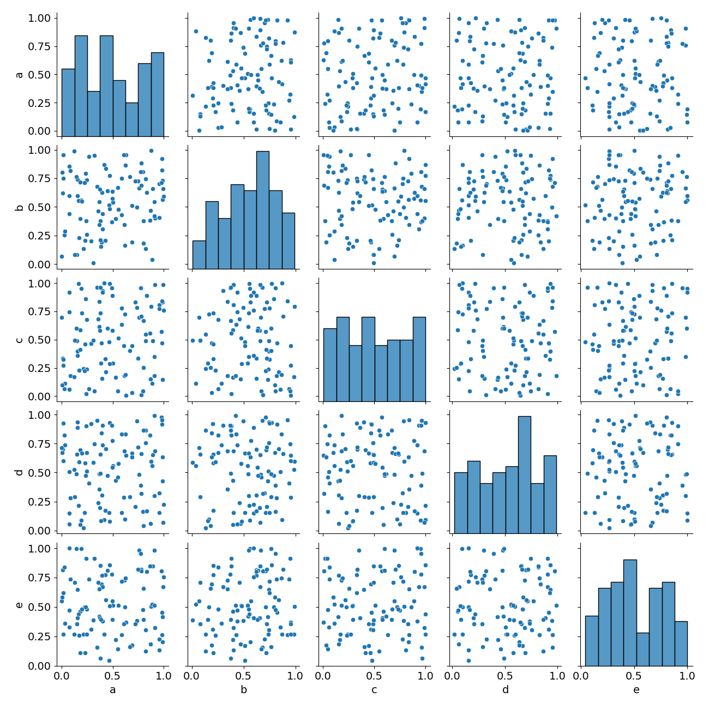

## Stack Overflow Survey Data Exploration
Explore a survey dataset with python tools

### Requirements
`pip install pipenv && pipenv install`

### Pandas Profiling Interactive Report

Click to view

### Seaborn Pairplot

Click to view

    

### Credits
The Public 2020 Stack Overflow Developer Survey Results https://insights.stackoverflow.com/survey
