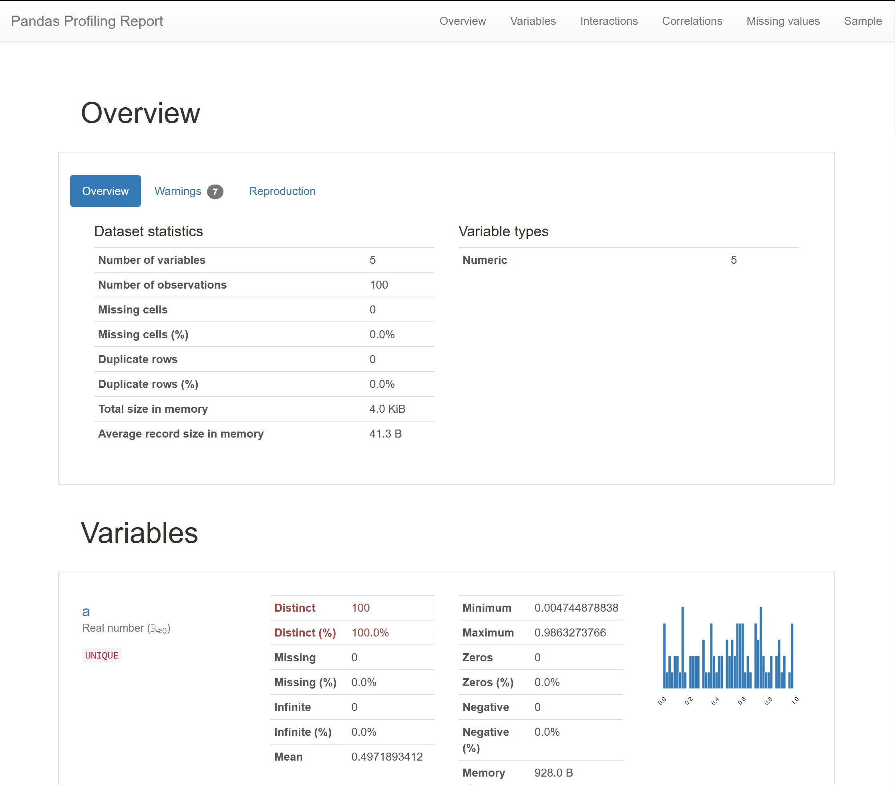
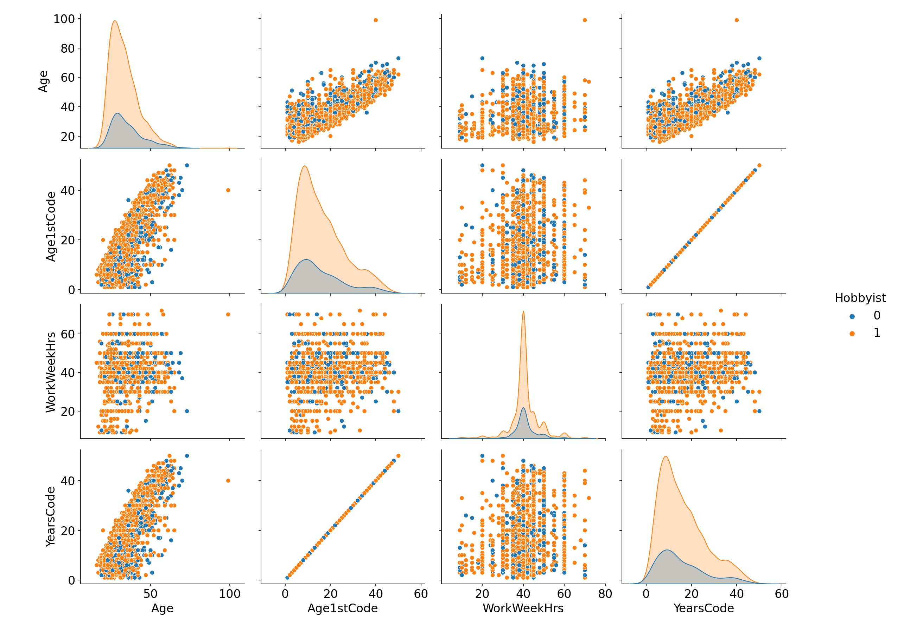

## Stack Overflow Survey Data Exploration
Explore a survey dataset with python tools

### Requirements
`pip install pipenv && pipenv install`

### Pandas Profiling Interactive Report
Click to go to interactive report  

### Seaborn Pairplot

Expand to view pairplot colored-coded by Hobbyist

    

### Credits
The Public 2020 Stack Overflow Developer Survey Results https://insights.stackoverflow.com/survey
